# MemeForge — starter (workshop)

> **🇮🇹 Crea un meme generator multi-formato in 35–40 minuti con Cursor + Pencil.dev.**

Questo è lo **starter** del workshop AI Builder. Lo cloni, lanci `pnpm dev`, e
hai già un'app italiana funzionante con landing, studio shell, autosave, e
ricerca immagini placeholder. Durante il workshop riempi 5 file `TODO` con
l'aiuto di Cursor — alla fine hai un mini-SaaS completo come
[`meme-studio`](../meme-studio).

**Cosa NON c'è nello starter** (per tenere il workshop a fuoco): video meme,
mock screen previews, controlli di testo avanzati. Tutti già implementati nel
[`meme-studio`](../meme-studio) finito per chi finisce in anticipo.

```
┌─────────────────────────────────────────────────────────────────┐
│ Node + pnpm pinnati con Devbox · Pexels key condivisa via .envrc │
│ Niente account, niente database, niente DB. Clone & run.        │
└─────────────────────────────────────────────────────────────────┘
```

## Prerequisiti — da installare PRIMA del workshop (~15 min)

> 🪟 **Windows** e 🍎 **macOS** funzionano entrambi con questa lista. Niente
> WSL, niente Devbox, niente comandi esoterici.

| # | Cosa | Dove | Note |
|---|---|---|---|
| 1 | **Cursor** (con account gratuito) | [cursor.com](https://cursor.com) | L'editor del workshop |
| 2 | **Node.js 22 LTS** | [nodejs.org](https://nodejs.org/en/download) | Installer ufficiale, opzioni di default |
| 3 | **pnpm** | dopo Node: `npm install -g pnpm` | Package manager |
| 4 | **Git** | [git-scm.com/downloads](https://git-scm.com/downloads) | Su Windows scegli *"Use Git from the command line"* |
| 5 | **Chrome** o **Edge** aggiornati | [google.com/chrome](https://www.google.com/chrome/) | Safari < 16.4 non supporta l'export video |

**Test rapido** — apri un terminale (macOS: *Terminal* · Windows: *PowerShell*) e lancia:

```bash
node --version    # v22.x
pnpm --version    # 10.x o superiore
git --version     # 2.x o superiore
```

Se tutti e tre rispondono, sei pronto. ✅

## Quick start (3 minuti) — il giorno del workshop

```bash
git clone https://github.com/yourusername/meme-studio-starter.git
cd meme-studio-starter
pnpm install
pnpm dev             # http://localhost:3000
```

Le variabili d'ambiente condivise del workshop (chiave Pexels, segreto JWT)
sono già nel repo in `.env.development` — Next.js le carica automaticamente.
**Non devi configurare niente.**

Apri http://localhost:3000 e vedi la landing in italiano. Click su
**"Apri lo Studio"** → vedi lo shell dell'editor con immagini placeholder
(la ricerca live Pexels si attiva dopo il TODO #2).

> Il canvas dice "TODO · implementa Canvas.tsx" — è proprio quello che faremo.

### Opzionale (utenti Mac/Linux esperti)

Se hai già `devbox` + `direnv` installati, `direnv allow` carica
automaticamente `.envrc` e ti pinna Node 22 + pnpm 10 alla versione
esatta. Non è necessario per il workshop.

## I 5 file da completare

| # | File | Min cumulati | Cosa fa |
|---|---|---|---|
| 1 | `components/editor/Canvas.tsx` | 5–17 | Stage di react-konva, drag/resize/rotate |
| 2 | `app/api/images/route.ts` | 17–23 | Proxy Pexels live + fallback seed SVG |
| 3 | `lib/export.ts` | 23–33 | Render multi-formato + ZIP + watermark |
| 4 | `app/api/stripe/checkout/route.ts` | 33–37 | Crea Stripe Checkout Session *(opzionale)* |
| 5 | `app/api/stripe/unlock/route.ts` | 37–40 | Verifica + firma JWT *(opzionale, locale già funziona)* |

I primi 3 TODO sono il **percorso core**. Stripe è opzionale: in modalità
locale `unlock` firma già un JWT gratuito e `checkout` ritorna un messaggio
italiano — basta per testare l'export.

Ogni file ha un commento `TODO` in cima con:
- l'obiettivo
- un **prompt pronto da incollare in Cursor**
- i pezzi già pronti da riutilizzare

**Cursor: come usarlo nel workshop**
1. Apri il file con il TODO.
2. Premi **⌘I** per aprire l'agent (oppure ⌘L per la chat). Verifica che la modalità sia "Agent".
3. Incolla il prompt suggerito dal commento TODO.
4. Cursor scrive il diff. Leggilo, premi **Accept**. Hot reload, prova, prossimo file.

## Pacing 35–40 minuti

```mermaid
gantt
    title Workshop AI Builder · 40 minuti
    dateFormat X
    axisFormat %M
    section Setup
    Clone + direnv + dev :a1, 0, 3
    section Pencil.dev
    Design + sync code   :a2, 3, 8
    section Editor (core)
    Canvas (Konva)       :a3, 8, 17
    Image API (Pexels)   :a4, 17, 23
    Export ZIP + WM      :a5, 23, 33
    section Stripe (opz.)
    Checkout             :a6, 33, 37
    Unlock JWT           :a7, 37, 40
    section Deploy
    Vercel button        :a8, 40, 42
```



Tempi pensati per **non-developer** che usano Cursor in modalità Agent
(prompt → revisione diff → accept → test). Se vuoi un format più corto
(20 min), salta export + Stripe e mostra solo Canvas + Image API.

## Min 3–8: Pencil.dev

Apri `designs/landing.pen` in Cursor (installa l'estensione **Pencil** se non
l'hai). Modifica qualcosa visivamente. Poi nel chat di Cursor:

> Aggiorna `app/page.tsx` per riflettere il design aggiornato in
> `designs/landing.pen`. Mantieni le stringhe in `lib/i18n/it.ts`.

Hot reload, design aggiornato. **Questo è il momento WOW** del workshop. Vedi
[`designs/README.md`](designs/README.md).

## Stack

- **Next.js 16** + App Router + TypeScript + Tailwind v4
- **react-konva** per il canvas editor
- **Pexels API** per le immagini (fallback: SVG inline)
- **Stripe Checkout** per il pagamento (fallback: sblocco gratuito in locale)
- **jose** per i JWT di sblocco
- **JSZip** per il bundle export
- **localStorage** per persistenza (zero DB, zero auth)

## Modalità

`direnv` carica i defaults condivisi dal `.envrc` (committato). L'app
rileva automaticamente cosa è configurato e si adatta:

| Stato | Comportamento |
|---|---|
| `.envrc` (default workshop) | Pexels live · Sblocco HD gratuito |
| + `STRIPE_SECRET_KEY` in `.envrc.local` | Checkout reale + JWT firmato |

Per chiavi personali (Stripe sandbox, una tua chiave Pexels, ecc.) crea
un `.envrc.local` (gitignored):

```bash
# .envrc.local — override personali, mai committato
export STRIPE_SECRET_KEY="sk_test_..."
export NEXT_PUBLIC_STRIPE_ENABLED="1"
```

Poi `direnv reload`. Vedi [`.env.example`](.env.example) per la lista
completa delle variabili.

## Deploy

[](https://vercel.com/new/clone?repository-url=https://github.com/yourusername/meme-studio-starter)

L'app funziona anche su Vercel senza env vars (modalità locale). Per il pagamento
reale, aggiungi le chiavi nelle "Environment Variables" del progetto Vercel.

## Versione completa

Se ti sei perso uno step o vuoi confrontare:
[`meme-studio`](../meme-studio) — stessa app, tutti i TODO riempiti.

## Crediti

Workshop AI Builder · Costruito con [Cursor](https://cursor.com) +
[Pencil.dev](https://pencil.dev).
