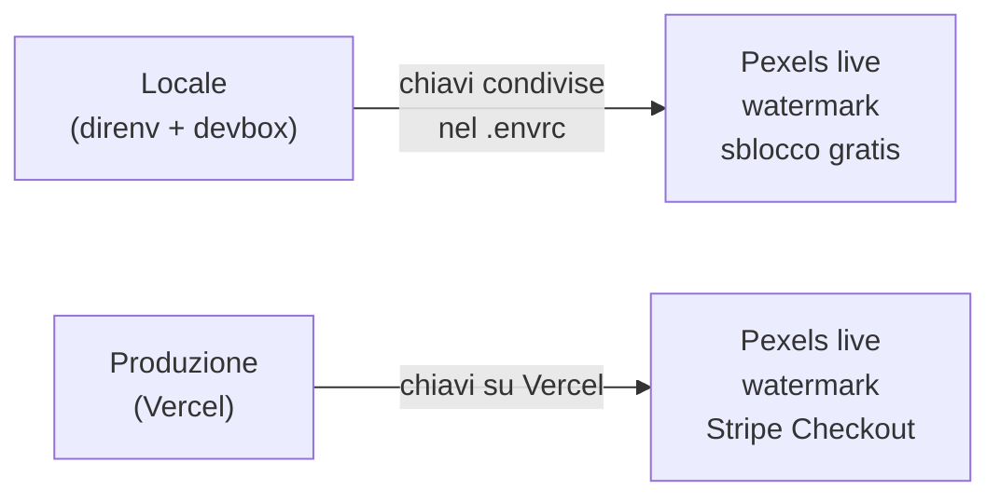
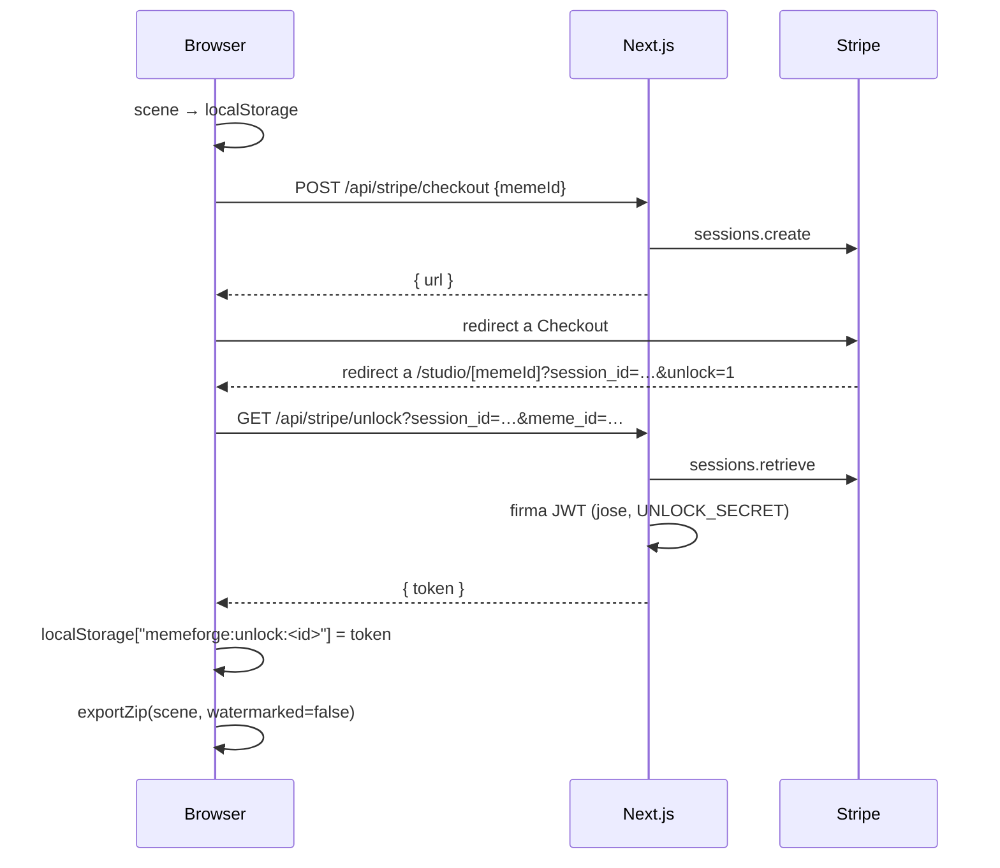

# MemeForge — finished

> **🇮🇹 Crea meme per ogni social, in un click.**
>
> Editor drag-and-drop in italiano. Esportazione simultanea per Instagram Post,
> Story, TikTok, Facebook, LinkedIn e X. Senza account, senza database. Sblocco
> HD con Stripe (€2,99) — facoltativo.

Versione **completa** della demo dell'AI Builder Workshop. Per la versione
"starter" da seguire passo-passo, vedi
[`meme-studio-starter`](../meme-studio-starter).

```
┌─────────────────────────────────────────────────────────────────┐
│ direnv allow && devbox shell && pnpm install && pnpm dev        │
│ ↳ Node + pnpm pinnati · Pexels API key condivisa · zero auth/DB │
└─────────────────────────────────────────────────────────────────┘
```

## Cosa contiene

| Layer | File |
|---|---|
| Landing (italiano) | `app/page.tsx` |
| Studio editor | `app/studio/page.tsx`, `app/studio/[memeId]/page.tsx` |
| Canvas (Konva) | `components/editor/Canvas.tsx` |
| Side panel + controlli | `components/editor/SidePanel.tsx` + figli |
| Video meme (Konva + RAF + MediaRecorder) | `components/editor/useVideo.ts`, `components/editor/CanvasNodes.tsx`, `lib/exportVideo.ts` |
| Export multi-formato (PNG ZIP) | `lib/export.ts` (Konva offscreen + JSZip) |
| Export multi-formato (WebM ZIP) | `lib/exportVideo.ts` (Canvas2D + MediaRecorder + JSZip) |
| Media API (Pexels immagini + video + seed) | `app/api/images/route.ts` |
| Stripe Checkout | `app/api/stripe/checkout/route.ts` |
| Verifica + JWT di sblocco | `app/api/stripe/unlock/route.ts` |
| Local storage (memes + JWT) | `lib/store.ts` |
| Stringhe italiane | `lib/i18n/it.ts` |
| Design Pencil.dev | `designs/landing.pen`, `designs/studio.pen` |

## Modalità



**Locale** = `direnv` carica `.envrc` con la chiave Pexels condivisa del
workshop, niente Stripe (sblocco HD gratis).
**Produzione** = imposta `PEXELS_API_KEY`, `STRIPE_SECRET_KEY`,
`UNLOCK_SECRET` su Vercel.

## Prerequisiti — da installare PRIMA (~15 min, Win + Mac)

| # | Cosa | Dove |
|---|---|---|
| 1 | **Cursor** (account gratuito) | [cursor.com](https://cursor.com) |
| 2 | **Node.js 22 LTS** | [nodejs.org](https://nodejs.org/en/download) |
| 3 | **pnpm** | `npm install -g pnpm` (dopo Node) |
| 4 | **Git** | [git-scm.com/downloads](https://git-scm.com/downloads) |
| 5 | **Chrome** o **Edge** aggiornati | per l'export video (Safari < 16.4 non supportato) |

**Verifica** (Terminal / PowerShell):

```bash
node --version   # v22.x
pnpm --version   # 10.x o superiore
git --version
```

## Setup

### Primo avvio

```bash
git clone <repo-url> && cd meme-studio
pnpm install
pnpm dev              # http://localhost:3000
```

Le env condivise del workshop (Pexels, `UNLOCK_SECRET`) sono in
`.env.development` (committato) — Next.js le carica in automatico.
Ricerca immagini + video funziona da subito.

### Opzionale (Mac/Linux): Devbox + direnv

Se hai [Devbox](https://www.jetify.com/docs/devbox/installing_devbox/) +
[direnv](https://direnv.net/docs/installation.html) installati, `direnv allow`
ti pinna Node 22 + pnpm 10 alla versione esatta e carica `.envrc`. Non è
necessario per il workshop.

### Override personali

Per chiavi tue (es. Stripe sandbox), crea un `.env.local` (gitignored):

```bash
# .env.local — override personali, mai versionato
STRIPE_SECRET_KEY=sk_test_...
NEXT_PUBLIC_STRIPE_ENABLED=1
```

Riavvia `pnpm dev`. Vedi [`.env.example`](.env.example) per la lista
completa delle variabili. (Se usi direnv, l'equivalente è `.envrc.local`.)

## Meme video

Quando aggiungi un video dalla tab "Video" della ricerca, MemeForge
crea un **meme video** invece di un'immagine statica:

- **Editor**: il video viene riprodotto in loop (muted) sul canvas Konva.
  Puoi sovrapporre testo, rettangoli e altre immagini come al solito.
  Usa il bottone **Riproduci / Pausa** in alto per fermare la riproduzione.
- **Export**: il pulsante "Scarica" produce uno ZIP con un file
  `.webm` per ogni formato selezionato (Instagram Post, Story, TikTok,
  Facebook, LinkedIn, X). La durata del video di output combacia con
  la durata del clip sorgente (con un cap a 15 secondi).
- **Sotto il cofano**: `lib/exportVideo.ts` dipinge ogni fotogramma su
  un `<canvas>` 2D, poi `canvas.captureStream()` alimenta un
  `MediaRecorder` che produce WebM (VP9/VP8). Niente backend, niente
  ffmpeg: tutto succede nel browser. Supportato da Chrome, Edge,
  Firefox e Safari 16.4+.

## Architettura



Nessun database, nessun webhook, nessun account. Il JWT funge da proof-of-purchase
e resta nel browser per un anno (claim `exp`).

## Pencil.dev

I file `designs/*.pen` sono **brief di design** in JSON. Apri con l'estensione
Pencil di Cursor per ridisegnare visivamente la landing o lo studio; poi chiedi
all'agente di sincronizzare il codice. Vedi
[`designs/README.md`](designs/README.md).

## Deploy

Un click su Vercel: cliccando il bottone qui sotto, l'env Stripe/Pexels è
opzionale — senza chiavi l'app gira lo stesso in modalità locale.

[](https://vercel.com/new/clone?repository-url=https://github.com/yourusername/meme-studio)

```bash
vercel link
vercel env add PEXELS_API_KEY production
vercel env add STRIPE_SECRET_KEY production
vercel env add UNLOCK_SECRET production
vercel --prod
```

## Limiti noti

- I meme non sono sincronizzati tra browser/dispositivi (per design — zero DB).
- L'unlock JWT è valido finché non lo cancelli da `localStorage`.
- Nessun webhook Stripe: se ti serve riconciliazione, aggiungi
  `app/api/stripe/webhook/route.ts` separatamente.

## Workshop

Vedi [`meme-studio-starter`](../meme-studio-starter) per la versione
incrementale (35–40 minuti, pacing dettagliato e prompt Cursor pronti).
